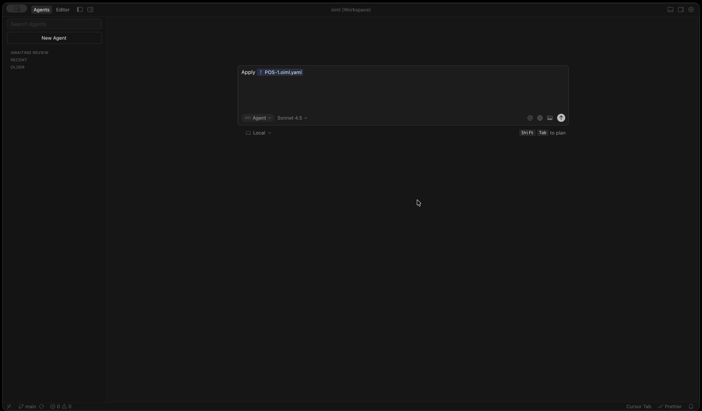

### What is OIML?

OIML (Open Intent Modeling Language) is a global standard for AI-driven development that enables:

- **Declarative Development**: Code is generated by simply declaring intents and providing the file as context to coding agents/IDEs
- **Standardized Schema**: All intents follow a consistent structure defined in the OpenIntent schema
- **Project Metadata**: Project configuration, such as frameworks used, is defined in a `project.yaml` file
- **Templates**: Out of the box context tailored to specific frameworks, provided to agents
- **Deterministic Generation**: No guessing - everything is explicitly declared
- **Agent Integration**: IDEs and agents can easily understand and apply intents

### Project Structure

```
.openintent/
├── project.yaml              # Project configuration and metadata
└── intents/                  # Intent files (.oiml.yaml)
    ├── INT-1.oiml.yaml       # Recommended to map to JIRA/Linear ticket #
    ├── INT-2.oiml.yaml
    └── INT-3.oiml.yaml
```

## Demo

The following demo illustrates the power of OIML. Given a single intent file (YAML) with a total of 9 intents (3 database entities + 6 APIs), Claude Sonnet-4.5 (tested with both Cursor and Claude Code) was able to successfully create an entire functional backend from scratch, with the YAML file as its only context, in appx. 2 minutes using Prisma + Next.js. The summary file of generated code changes, which is a key component of the OIML audit trail, is included below.

[](assets/demo.mov)

Output file:

```yaml
version: 0.1.3
applied_at: 2025-11-05T22:30:04Z
status: success
intents_processed: 9
model: claude-sonnet-4.5

changes:
  - file: prisma/schema.prisma
    action: modified
    description: Added User model with id, email, and name fields; included one-to-many relation to Post and one-to-one relation to Profile

  - file: prisma/schema.prisma
    action: modified
    description: Added Post model with id, created_at, updated_at, title, content, published, and author_id fields; included many-to-one relation to User via author_id

  - file: prisma/schema.prisma
    action: modified
    description: Added Profile model with id, bio, and user_id fields; included one-to-one relation to User via user_id

  - file: prisma/migrations/20251105223004_add_blog_entities/migration.sql
    action: created
    description: Created Prisma migration for User, Post, and Profile entities with all relations

  - file: packages/types/index.ts
    action: modified
    description: Added TypeScript interfaces for User, Post, and Profile entities with proper null handling for nullable fields

  - file: packages/types/index.ts
    action: modified
    description: Added UserResponse, PostResponse, and ProfileResponse types following the project response format configuration

  - file: packages/types/index.ts
    action: modified
    description: Updated ErrorResponse to include success field for consistency

  - file: app/api/users/route.ts
    action: created
    description: Created POST /api/users endpoint to create new users with email validation and proper error handling

  - file: app/api/users/route.ts
    action: created
    description: Created GET /api/users endpoint to fetch all users ordered by id descending

  - file: app/api/users/[id]/posts/route.ts
    action: created
    description: Created GET /api/users/{id}/posts endpoint to fetch all posts for a specific user with user existence validation

  - file: app/api/posts/route.ts
    action: created
    description: Created POST /api/posts endpoint to create new posts with title and author_id validation and author existence check

  - file: app/api/profiles/route.ts
    action: created
    description: Created GET /api/profiles endpoint to fetch all profiles ordered by id descending

  - file: app/api/profiles/[id]/route.ts
    action: created
    description: Created GET /api/profiles/{id} endpoint to fetch a single profile by id with proper 404 handling

errors: []

summary: |
  Successfully applied all 9 intents from POS-1.oiml.yaml:
  - Added 3 database entities (User, Post, Profile) to Prisma schema
  - Configured 2 relations (Post->User many-to-one, Profile->User one-to-one)
  - Created and applied Prisma migration
  - Generated TypeScript types with proper null handling
  - Created 6 API endpoints following Next.js App Router conventions
  - All endpoints include proper error handling, validation, and response formatting per project.yaml configuration
  - No linting errors detected
```

OIML aims to be LLM and framework agnostic, so the schema will support a wide range of popular frameworks, and work across all major LLMs (e.g. Sonnet-4.5, GPT-5, Cursor Composer).

Below is a real snippet provided to LLMs as intents are processed.

## Intent File Schema

All intent file schemas are defined in the `@oiml/schema` package. Refer to the schema package for:
- Complete intent structure definitions
- Field validation rules
- Required vs optional fields
- Supported values and enums

**Basic Structure:**
- `version`: Semantic version (required)
- `provenance`: Optional metadata about intent creation
- `intents`: Array of intent specifications

**For complete schema definitions, consult `@oiml/schema` package.**

### Intent Types Overview

#### Database Framework Implementation Guides

**IMPORTANT:** Before generating database schema code for any data intent (`add_entity`, `add_field`, `add_relation`, `remove_field`), you MUST:

1. **Read `project.yaml`** to determine the database configuration
2. **Check the `database.framework` field** to determine which guide to use:
   - If `database.framework: "prisma"` → Use `@oiml/schema/templates/database/prisma.md`
   - If `database.framework: "sqlalchemy"` → Use SQLAlchemy guide in `@oiml/schema/templates/database/`
   - If using raw SQL → Use PostgreSQL/MySQL guide in `@oiml/schema/templates/database/`
3. **Consult the framework-specific guide** for:
   - Complete field type mappings
   - Implementation steps for each intent type
   - Code examples and templates
   - Migration handling
   - Best practices

The framework-specific guides contain all the details needed for implementation. This document provides high-level intent structure only.

### Supported Intent Types

OpenIntent supports the following intent types. For complete schema definitions, see `@oiml/schema`.

#### Data Intents (scope: data)
- **`add_entity`**: Create new database models/entities
- **`add_field`**: Add fields to existing entities
- **`add_relation`** (scope: schema): Add relationships between entities
- **`remove_field`**: Remove fields from entities

#### API Intents (scope: api)
- **`add_endpoint`**: Create REST API endpoints

#### UI Intents (scope: ui)
- **`add_component`**: Create UI components (future support)

### Implementation Workflow

For each intent type:

1. **Validate the intent** using the schema from `@oiml/schema`
2. **Read `project.yaml`** to determine frameworks
3. **Consult the appropriate framework guide**:

   **For Data Intents** (`add_entity`, `add_field`, `add_relation`, `remove_field`):
   - Check `database.framework` in `project.yaml`
   - **Prisma** → See `@oiml/schema/templates/database/prisma.md`
   - **Other frameworks** → See respective database guide in `@oiml/schema/templates/database/`

   **For API Intents** (`add_endpoint`):
   - Check `api.framework` in `project.yaml`
   - **Next.js** → See `@oiml/schema/templates/api/nextjs.md`
   - **Other frameworks** → See respective API guide in `@oiml/schema/templates/api/`

   **For UI Intents** (`add_component`):
   - Check `ui.framework` in `project.yaml`
   - Follow framework-specific component generation patterns

4. **Follow the framework guide's detailed instructions**
5. **Verify generated code** matches project patterns

## Project Configuration (project.yaml)

### Key Sections

**API Configuration:**

```yaml
api:
  framework: nextjs # API framework: nextjs, express, fastapi, etc.
  language: typescript # Language: typescript, javascript, python, etc.
  response: # Response format configuration
    success:
      kind: object # Response kind: object, array, etc.
      format: json # Format: json, xml, etc.
      object: data # Success response wrapper field name
    error:
      kind: object
      format: json
      object: error # Error response wrapper field name
```

**Paths Configuration:**

```yaml
paths:
  api: app/api # API routes directory
  components: app/components # Components directory
  entities: prisma # Prisma schema location
  utils: packages/utils # Utilities directory
  types: packages/types # TypeScript types directory
  tests: tests # Tests directory
```

**Database Configuration:**

```yaml
database:
  type: postgres # Database type
  framework: prisma # Database framework: prisma, mongoose, sqlalchemy, etc.
  schema: prisma/schema.prisma # Schema file path
  connection: env:DATABASE_URL # Connection string (env variable)
```

**UI Configuration:**

```yaml
ui:
  base_components: # Available UI components
    - Input: "@/components/ui/input"
    - Button: "@/components/ui/button"
    - Card: "@/components/ui/card"
  theme:
    primary_color: "#2563eb"
    accent_color: "#f59e0b"
    border_radius: "0.75rem"
```

## Implementation Workflow

When processing an intent file, follow these steps:

### 1. Validate Intent File
- Use OpenIntent MCP server: `mcp_openintent_validate_intent(filePath)` if available
- Verify file exists and is valid YAML
- Validate against schema from `@oiml/schema`
- **Stop immediately if validation fails** - do not apply any code changes

### 2. Read Project Configuration
- Read `.openintent/project.yaml`
- Extract framework configurations:
  - `database.framework` - for data intents
  - `api.framework` - for API intents
  - `ui.framework` - for UI intents
- Note configured paths (`paths.api`, `paths.types`, etc.)

### 3. Process Each Intent
For each intent in the `intents` array:

1. **Identify the intent type** (`kind`)
2. **Determine the framework guide** based on `project.yaml`:
   - Data intents → Check `database.framework` → Use guide from `@oiml/schema/templates/database/`
   - API intents → Check `api.framework` → Use guide from `@oiml/schema/templates/api/`
   - UI intents → Check `ui.framework` → Use guide from `@oiml/schema/templates/ui/`
3. **Follow the framework guide** for detailed implementation steps
4. **Generate code** according to the guide's instructions

### 4. Verify and Complete
- Check for linting errors
- Verify file paths match `project.yaml` configuration
- Ensure all imports are correct
- Test generated code follows project patterns

**Important**: All detailed implementation steps, code examples, and type mappings are in the framework-specific guides. This document only provides high-level orchestration.

## Code Generation Patterns

All framework-specific code generation patterns, examples, and best practices are documented in the respective implementation guides in `@oiml/schema/templates/`:

### Database Patterns

- **Prisma**: See `@oiml/schema/templates/database/prisma.md` for:
  - Field type mappings
  - Database client usage
  - Migration patterns
  - TypeScript type generation
  - Common patterns and best practices

- **Other database frameworks**: See `@oiml/schema/templates/database/` for available guides

### API Patterns

- **Next.js**: See `@oiml/schema/templates/api/nextjs.md` for:
  - Route handler templates
  - HTTP method implementations
  - Response structure patterns
  - Error handling patterns
  - Authentication patterns
  - Database client integration

- **Other API frameworks**: See `@oiml/schema/templates/api/` for available guides

### Key Principles

1. **Response Structure**: Always follow `api.response` configuration from `project.yaml`
   - Success responses use `api.response.success.object` field (e.g., `data`)
   - Error responses use `api.response.error.object` field (e.g., `error`)

2. **Type Safety**: Generate proper types for all entities and responses

3. **Error Handling**: Include comprehensive error handling with appropriate HTTP status codes

4. **Database Integration**: Use the database client specified in `database.framework`

**For complete code examples and templates, refer to the framework-specific implementation guides.**

## MCP Server Integration

If available, use the OpenIntent MCP server for validation:

```javascript
// Validate intent file
const validation = await mcp_openintent_validate_intent(filePath);
if (!validation.valid) {
  throw new Error(`Invalid intent: ${validation.message}`);
}
```

## Best Practices

1. **Always validate**: Use MCP server validation when available
2. **Follow conventions**: Match existing code patterns in the project
3. **Type safety**: Always use TypeScript types, never `any`
4. **Error handling**: Include comprehensive error handling
5. **Code organization**: Respect project.yaml paths and structure
6. **Migration safety**: Always create migrations for schema changes
7. **Documentation**: Add comments for complex logic
8. **Testing**: Generate test-friendly code structures

## Example: Processing an Intent File

**Given**: An intent file with `add_entity` and `add_endpoint` intents (see `@oiml/schema` for structure)

**Workflow**:

1. ✅ **Validate** intent file against schema
2. ✅ **Read** `.openintent/project.yaml`
3. ✅ **Process** `add_entity` intent:
   - Consult database framework guide (e.g., Prisma guide)
   - Add model to schema
   - Create migration
   - Update TypeScript types
4. ✅ **Process** `add_endpoint` intent:
   - Consult API framework guide (e.g., Next.js guide)
   - Create route handler file
   - Implement HTTP method
   - Add response types
5. ✅ **Verify** all generated code
6. ✅ **Create** output summary file

